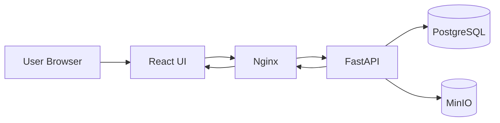
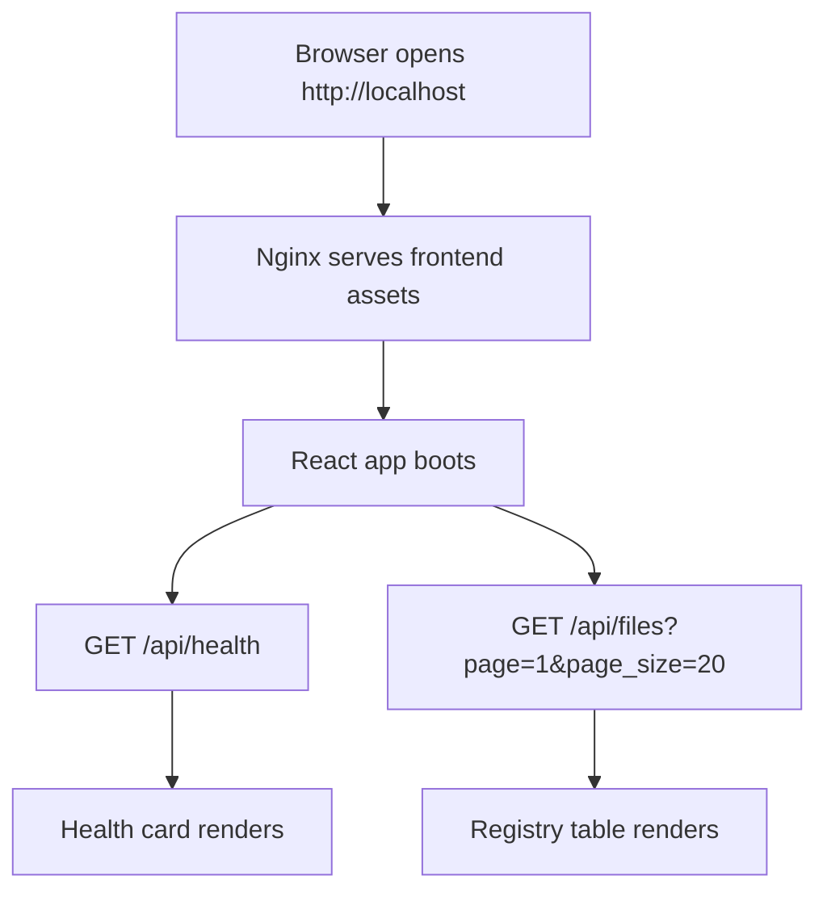
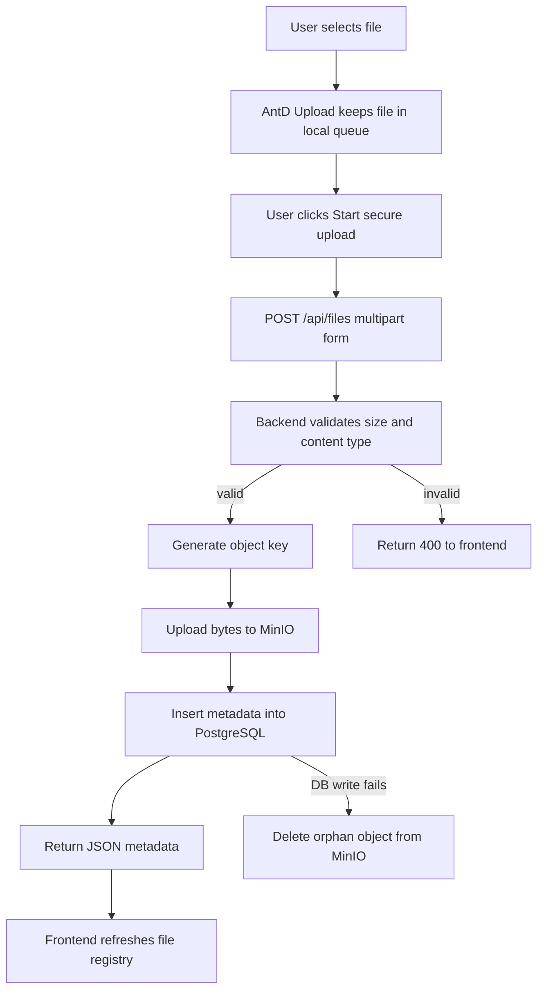
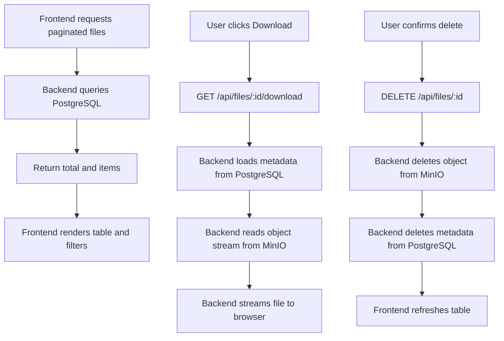
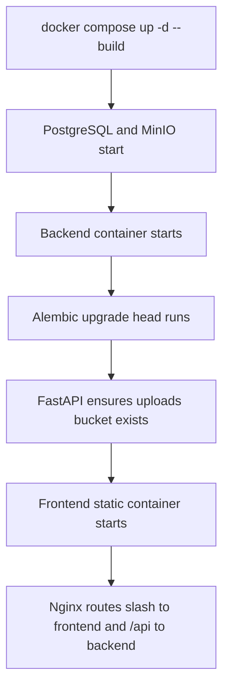

# POC MinIO - Full Stack File Manager

Upload, list, download, and delete files using **React + Ant Design** frontend, **FastAPI** backend, **MinIO** object storage, and **PostgreSQL** metadata — all orchestrated with **Docker Compose**.

## Flow Overview



## Runtime Flow



## Upload Flow



## File Management Flow



## Startup Flow



## Architecture

```
┌──────────────────────────────────────────┐
│            nginx (port 80)               │
│   /api/* → backend    /* → frontend      │
├──────────┬───────────┬───────────────────┤
│ Frontend │  Backend  │  MinIO  │ Postgres│
│ React    │  FastAPI  │  :9000  │  :5432  │
│ Ant Design│  uv      │  :9001  │         │
└──────────┴───────────┴─────────┴─────────┘
```

## Quick Start

```bash
# 1. Clone and enter the project
cd poc_minio

# 2. Start everything (builds + runs all services)
./scripts/start.sh

# 3. Open in browser
open http://localhost
```

**Services:**

| Service        | URL                        | Credentials            |
|----------------|----------------------------|------------------------|
| Web App        | http://localhost            | -                      |
| API Docs       | http://localhost:8000/docs  | -                      |
| MinIO Console  | http://localhost:9001       | minioadmin / minioadmin|
| PostgreSQL     | localhost:5432              | postgres / postgres    |

## API Endpoints

| Method   | Path                       | Description              |
|----------|----------------------------|--------------------------|
| `GET`    | `/api/health`              | Health check             |
| `POST`   | `/api/files`               | Upload file (multipart)  |
| `GET`    | `/api/files`               | List files (paginated)   |
| `GET`    | `/api/files/{id}`          | Get file metadata        |
| `GET`    | `/api/files/{id}/download` | Stream file download via backend |
| `DELETE` | `/api/files/{id}`          | Delete file              |

## Project Structure

```
poc_minio/
├── backend/                 # Python FastAPI + uv
│   ├── app/
│   │   ├── main.py          # App entrypoint
│   │   ├── config.py        # Environment config
│   │   ├── database.py      # SQLAlchemy setup
│   │   ├── models.py        # DB models
│   │   ├── schemas.py       # Pydantic schemas
│   │   ├── services.py      # Business logic
│   │   ├── minio_client.py  # MinIO wrapper
│   │   └── routers/         # API routes
│   ├── alembic/             # DB migrations
│   ├── pyproject.toml
│   └── Dockerfile
├── frontend/                # React + Vite + Ant Design
│   ├── src/
│   │   ├── api/client.ts    # API client
│   │   ├── components/      # UI components
│   │   └── pages/           # Page components
│   ├── package.json
│   └── Dockerfile
├── nginx/                   # Reverse proxy
│   └── nginx.conf
├── scripts/                 # Helper scripts
│   ├── start.sh
│   ├── stop.sh
│   ├── migrate.sh
│   └── smoke-test.sh
├── docker-compose.yml
├── .env.example
└── README.md
```

## Development

### Backend only (local)

```bash
cd backend
cp ../.env.example .env
# Edit .env: set MINIO_ENDPOINT=localhost:9000, DATABASE_URL with localhost
uv run uvicorn app.main:app --reload --host 0.0.0.0 --port 8000
```

### Frontend only (local)

```bash
cd frontend
npm install
npm run dev
# Proxies /api to localhost:8000 via vite.config.ts
```

### Run migrations manually

```bash
./scripts/migrate.sh
```

### Smoke test

```bash
./scripts/smoke-test.sh
```

## Environment Variables

See [.env.example](.env.example) for all variables.

## Stopping

```bash
./scripts/stop.sh
# Or to remove volumes too:
docker compose down -v
```
